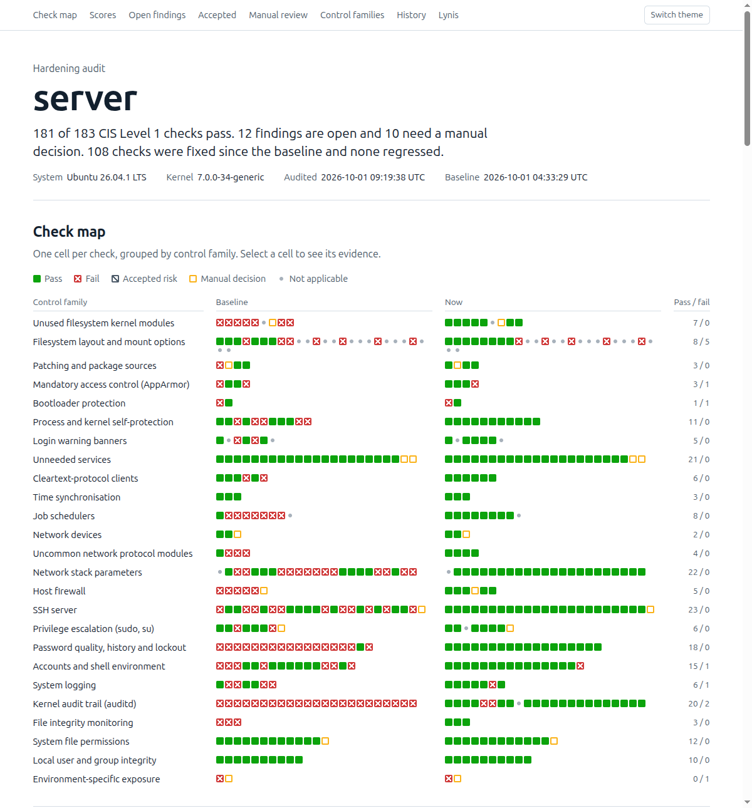

# HardenProof

[](https://github.com/parthabishwas/hardenproof/actions/workflows/ci.yml)
[](https://github.com/parthabishwas/hardenproof/releases)
[](LICENSE)

Harden an Ubuntu server against the CIS benchmark, and prove what changed: audit before,
guarded apply, audit after, one HTML report.



Most hardening scripts change a system and leave you to assume the result. HardenProof
treats hardening as a change that has to be justified and evidenced:

- **Audit first.** More than 260 read-only checks mapped to CIS benchmark sections, each with
  the evidence that decided it, plus an independent [Lynis](https://cisofy.com/lynis/) run.
- **Know what you are changing.** Every control family documents what changes, why, what it
  can break, how to verify it and how to undo it.
- **Apply without locking yourself out.** Preflight checks, a full `/etc` backup, and a
  dead-man switch that restores SSH, PAM, sudo, accounts and the firewall unless the run
  proves it can still log in.
- **Audit again, and keep auditing.** The report shows every check before and after, the
  history of all audits, and what regressed since the last one. Scheduled audits can fail a
  job when a control drifts.
- **Record what you chose not to fix.** Accepted risks have a reason, an owner and an expiry.

On an Ubuntu 26.04 test VM this took CIS Level 1 from 55.7% to 98.9% of checks passing
([worked example](docs/EXAMPLE-ASSESSMENT.md)). A score is a measurement of configuration,
not a statement that a system is secure; the open-findings list is the result that matters.

## Read this before you run it

`./harden.sh all` changes how you reach the server. After it:

- **SSH accepts keys only**, root cannot log in, and only the users you list are allowed.
- **A default-deny firewall is on.** Only the ports you list are reachable.
- `su` is restricted, idle shells close after 15 minutes, `/tmp` is `noexec` where it is a
  tmpfs, SSH forwarding is off, and the host reboots only if you allow it.

Run it on a clone or snapshot first, and have console access (hypervisor, provider web
console, BMC) before running it on anything you cannot rebuild. `./harden.sh audit` and
`./harden.sh plan` change no configuration and are safe to run anywhere. (`audit` leaves
three things on the host: the audit script in `/var/lib/hardening-audit/`, a pinned Lynis in
`/opt/lynis-<version>/`, and Lynis' log and report in `/var/log/`. With `--no-lynis` only the
audit script is left.)

## Supported systems

| Target | Status |
|---|---|
| Ubuntu 26.04 LTS | Tested end to end (server install, sudo-rs, Docker, password sudo) |
| Ubuntu 24.04 LTS | Tested end to end (official cloud image, password sudo) |
| Ubuntu 22.04 LTS | Tested end to end (official cloud image, passwordless sudo) |
| Ubuntu interim releases | Accepted by the preflight, not tested |
| Ubuntu older than 22.04 | Hardening refuses to run. The audit script still runs, untested |
| Anything that is not Ubuntu | Not supported. The preflight and the audit script both refuse to run |

"End to end" means a person ran, on a freshly created x86-64 virtual machine: baseline audit,
hardening, reboot, re-audit, a second hardening run, revert of every family, and
re-hardening. On each Ubuntu release that ended at 98% of CIS Level 1 checks passing, with
the remaining items being ones a playbook cannot fix (partitioning, GRUB password, a log
collector). CI lints the code and tests the report generator and the wrapper; it does not run
a hardening pass.

### What you need

**On the machine you run it from (the controller):**

- Linux. macOS is untested and needs bash 4.4 or later and GNU sed for the tests.
- Python 3.10 or later, `ssh`, `git`. `sshpass` only if you install the SSH key with a
  password.
- Network access to the targets, to `galaxy.ansible.com` (collections, once) and to
  `github.com` (the pinned Lynis release, once).

**On each target:**

- A non-root account with sudo and an SSH key. Its UID must be 1000 or higher, and its
  password must not be older than the maximum age the run sets (365 days, or 90 with the
  `pci` profile). The preflight checks both.
- Python 3, systemd, apt with working package sources, and 2 GB free on `/`.
- A full system: containers and WSL are not supported.

## Install

```bash
git clone https://github.com/parthabishwas/hardenproof.git
cd hardenproof
python3 -m venv .venv
.venv/bin/pip install -r requirements.txt
.venv/bin/ansible-galaxy collection install -r requirements.yml -p ./collections
./harden.sh --version
```

## Quick start

1. **Describe your host.** Copy the template and edit the files in it:

   ```bash
   cp -r inventory/example inventory/prod
   $EDITOR inventory/prod/hosts.yml                              # address, port, user, key
   $EDITOR inventory/prod/group_vars/servers/overrides.yml       # allowed users, open ports
   ```

   Inventories other than the template are git-ignored, so host names stay out of the repo.

   Put your settings in a **named group** (`group_vars/servers/`, as in the template) or in
   `host_vars/`. Ansible ranks the baseline in `playbooks/group_vars/all/` above
   `group_vars/all/` in an inventory, so settings placed in the inventory's `all` group are
   silently ignored.

2. **Trust the host key.** Ansible and the playbook's own checks refuse unknown hosts.
   Verify the fingerprint through a channel you trust, then:

   ```bash
   ssh-keyscan -p <port> <host> >> ~/.ssh/known_hosts
   ```

3. **Provide the sudo password** through the environment. Nothing is read from files.

   ```bash
   export HARDEN_BECOME_PASS='...'      # empty value for passwordless sudo
   ```

4. **Install your SSH key** if the host still uses password login (one time). The public
   key must sit next to the private key as `<key>.pub`.

   ```bash
   HARDEN_SSH_PASS='...' .venv/bin/ansible-playbook -i inventory/prod/hosts.yml playbooks/bootstrap-access.yml
   ```

5. **Audit.** Changes no configuration; produces the baseline report.

   ```bash
   ./harden.sh audit -i inventory/prod/hosts.yml
   ```

6. **Review the plan, then run the cycle.**

   ```bash
   ./harden.sh plan -i inventory/prod/hosts.yml     # dry run with file-level diffs
   ./harden.sh all  -i inventory/prod/hosts.yml     # baseline -> harden -> re-audit -> report
   ```

   Open `reports/<host>/latest/report.html`, or `reports/index.html` for all hosts.

## Commands

| Command | What it does | Changes the host |
|---|---|---|
| `./harden.sh audit` | Baseline audit for hosts that have none, a new dated audit for the others, then the reports | No |
| `./harden.sh plan` | Dry run of the hardening playbook (`--check --diff`) | No |
| `./harden.sh apply` | Hardening only | Yes |
| `./harden.sh all` | Baseline (kept if it exists), harden, re-audit, report | Yes |
| `./harden.sh report` | Rebuild the HTML reports from saved audit results | No |
| `./harden.sh revert <family>...` | Undo one or more control families | Yes |

| Option | Meaning |
|---|---|
| `-i <inventory>` | `hosts.yml` or the directory that holds it. Default: the one in `ansible.cfg` |
| `-l <host or group>` | Limit to some hosts |
| `-y`, `--yes` | Skip the confirmation prompt |
| `--rebaseline` | Start over: move the host's saved audits to `reports/<host>/_archive-<time>/` and take a new baseline |
| `--fail-on-regression` | Exit 3 when a check that passed in the previous audit now fails |
| `--no-lynis` | Audit with the CIS-mapped checks only. Lynis is not downloaded, copied or run, and the report has no Lynis index. To make that permanent, set `hardening_audit_lynis: false` in your overrides |
| `--version` | Print the version |

Commands that change hosts list them and wait for you to type `yes`. An existing baseline is
never overwritten: adding a host to the inventory takes a baseline for that host only.

**Exit status.** 0 success. 3 a regression was found (with `--fail-on-regression`). 1 a usage
or report error. Any other value is Ansible's: 2 a host failed, 4 a host was unreachable.
When one host fails, reports are still built for the others and the command still exits
non-zero.

The steps are ordinary playbooks if you prefer to run them yourself:

```bash
.venv/bin/ansible-playbook -i <inventory> playbooks/audit.yml -e label=baseline
.venv/bin/ansible-playbook -i <inventory> playbooks/harden.yml --check --diff
.venv/bin/ansible-playbook -i <inventory> playbooks/harden.yml --tags ssh       # one stage
.venv/bin/python tools/report.py --current reports/<host>/<run> --baseline reports/<host>/baseline \
    --history reports/<host> --out reports/<host>/<run>
```

Stage tags: `os`, `extras`, `ssh`, `post`, and inside the extras role `packages`, `modules`,
`interfaces`, `mounts`, `services`, `banners`, `cron`, `sudo`, `pam`, `accounts`, `logging`,
`auditd`, `firewall`. Preflight, backup and the rollback guard run regardless of tags.

The audit script also runs on its own, as root, on the host:

```bash
sudo audit/cis_audit.sh > cis_audit.tsv
```

## Settings you must review

Set these per environment in `inventory/<env>/group_vars/<group>/overrides.yml`.

| Variable | Default | Why it matters |
|---|---|---|
| `hardening_ssh_allow_users` | `[]` | Only these accounts can log in over SSH. Must include the automation user or the run refuses to start |
| `hardening_fw_allow` | 22/tcp | Every other inbound port is dropped. Add your application ports. Rules are added, never removed |
| `hardening_ssh_password_auth` | `false` | Key-only SSH. The run proves key login works before turning passwords off |
| `hardening_allow_reboot` | `false` | Some changes (kernel command line, `/tmp` as tmpfs) need a reboot to take effect |
| `hardening_apply_updates` | `false` | `true` installs pending package updates during the run, which restarts services |
| `hardening_guard_minutes` | `20` | Time each guarded stage has before the host rolls itself back. Raise it with `hardening_apply_updates` or on slow hosts |
| `hardening_profile` | `cis` | `pci` adds the stricter PCI DSS password age (90 days) and lockout (30 minutes) |
| `os_ignore_users` | `[]` | Service accounts under UID 1000 otherwise lose their login shell and get a locked password |
| `hardening_cron_allow_users` | `[root]` | Other users cannot edit crontabs |
| `hardening_syslog_remote_host` | empty | Without a collector, logs exist only on the host. `hardening_syslog_remote_tls: true` sends them over TLS |
| `hardening_docker_filter` | `false` | `true` limits Docker-published ports to `hardening_docker_published_allow` |
| `hardening_tmp_tmpfs` | `false` | On 22.04 and 24.04, `true` moves `/tmp` to a tmpfs at the next boot so it can be `noexec` |
| `hardening_disable_units` | `[]` | Services to mask. Empty because "unneeded" depends on the host |
| `hardening_sysctl_extra` | `{}` | Kernel parameters that must differ on this host |

All switches, with the reasoning for each default, are in
[`roles/hardening_extras/defaults/main.yml`](roles/hardening_extras/defaults/main.yml) and
[`playbooks/group_vars/all/baseline.yml`](playbooks/group_vars/all/baseline.yml).

The SSH port is not changed by a run. If your sshd listens on another port, set
`hardening_ssh_port` to that port and allow it in `hardening_fw_allow`; the preflight stops
when they disagree with what sshd actually uses.

## What it detects about each host

Nothing in the playbooks is tied to a particular machine, hypervisor or provider. Where the
right value depends on the host, the preflight inspects it and prints what it decided:

| Detected | Effect |
|---|---|
| Docker installed, or the host already forwards packets | IP forwarding stays on (containers, VMs, VPN gateways and routers need it). The audit keeps reporting it |
| Several default routes or policy routing | Reverse-path filtering is loose instead of strict, so replies on asymmetric paths are not dropped |
| No dedicated `/var/log/audit` filesystem | Audit logs rotate within a fixed size instead of "never delete, halt when full", which would take a single-filesystem host offline |
| A global IPv6 address | sshd listens on IPv6 as well as IPv4 |
| IPv6 default route learned from kernel router advertisements | The run stops until you decide: keep it (`hardening_sysctl_extra` with `net.ipv6.conf.all.accept_ra: 1` and `net.ipv6.conf.default.accept_ra: 1`) or accept losing it (`hardening_accept_ipv6_loss: true`) |
| sudo-rs as the default sudo (Ubuntu 25.10+) | Automation uses the classic `sudo.ws`; the sudo log-file option, which sudo-rs rejects, is left out |
| `/tmp` on the root filesystem | Mount options are skipped unless `hardening_tmp_tmpfs` is set |
| Kernel modules that are loaded, or back a mounted filesystem | Never disabled |
| A container runtime (Docker, containerd, Podman, CRI-O, k3s) | `overlay` is not disabled |
| The automation account would be locked out by account hardening | The run refuses to start and says why |

## What it changes

| Area | Change |
|---|---|
| SSH | Keys only, no root login, user allow-list, modern ciphers/MACs/KEX, idle timeout, no forwarding, banner |
| Firewall | ufw, default deny inbound and routed, explicit allow-list; optional filter for Docker-published ports |
| Authentication | Password quality (14+ characters), history, lockout after 5 failures, no empty passwords |
| Accounts | Password ageing, inactive lock, umask 027, shell idle timeout, home directories 0700; system accounts (UID 1 to 999) get no shell and a locked password |
| sudo and su | `use_pty`, 15-minute credential cache, `su` limited to an empty group |
| Scheduled jobs | Cron files root-only, `cron.allow` and `at.allow` allow-lists |
| Kernel | Core dumps off, apport and kdump masked, restricted ptrace/dmesg/kernel pointers, unprivileged BPF and user namespaces off |
| Network stack | No redirects or source routing on any interface, reverse-path filtering, SYN cookies, no IPv6 RA |
| Filesystems | `noexec` on `/tmp` and `/dev/shm`; unused filesystem and protocol modules and `usb-storage` disabled |
| Privileged binaries | Setuid bit removed from a short deny list (`ssh-keysign`, `pppd`, `mtr`, `arping` ...) |
| Audit and integrity | auditd with a CIS-style rule set, immutable; AIDE baseline and daily check |
| Logging | Persistent compressed journal, tighter log permissions, optional remote forwarding with TLS |
| Packages | Cleartext clients (telnet, ftp) removed; pending updates installed only if you enable it |

Why each setting has the value it has, with references:
[`docs/RATIONALE.md`](docs/RATIONALE.md). What each control family can break and how
to undo it: [`controls/catalogue.yml`](controls/catalogue.yml).

It does **not** change the SSH port, set a GRUB password, repartition, disable IPv6, change
any user's password, delete users' `.netrc` or `.rhosts` files, or filter outbound traffic.
The rationale explains each.

## Leaving a control out, and accepting a finding

Not every finding should be fixed. Some are open on purpose: a bastion needs TCP forwarding,
a build host needs an executable `/tmp`. Two files per environment keep those decisions
visible instead of silently skipped.

**Do not apply the control.** Set its variable in
`inventory/<env>/group_vars/<group>/overrides.yml`, with the reason next to it:

```yaml
# Bastion: forwarding is this host's purpose.
ssh_allow_tcp_forwarding: "yes"
# Build agents compile and run from /tmp.
hardening_tmp_noexec: false
# Asymmetric routing on the storage network.
hardening_sysctl_extra: { net.ipv4.conf.all.rp_filter: 2 }
```

Whole families can also be turned off (`hardening_firewall`, `hardening_audit_rules`,
`hardening_aide`) or skipped for one run with `--skip-tags`.

**Accept the finding.** The audit measures the benchmark, not your intent, so a control you
left out keeps failing. Record the decision in `inventory/<env>/exceptions.yml`:

```yaml
exceptions:
  - id: SSH-08
    reason: Bastion host; TCP forwarding is its purpose. Source IPs are restricted at the firewall.
    accepted_by: Security Lead
    expires: 2027-03-31
    hosts: [bastion01]        # optional; omit to cover every host in this inventory
```

The report then lists it under **Accepted risks**, with the reason, owner and expiry, instead
of under open findings. The rules are deliberately strict:

- All of `id`, `reason`, `accepted_by` and `expires` are required, and a check can appear
  once per host; the report refuses to build otherwise.
- When the date passes, the finding returns to the open list, marked as expired.
- An accepted failure still counts against the score. Accepting a risk does not make the
  benchmark pass.
- Entries for checks that pass again are reported as stale, so the register stays short.
- The audit evidence is never altered; acceptance is applied when the report is built.
- Manual-review checks can be accepted the same way, which records that someone reviewed them.

## Undoing a control

Turning a control off in the inventory stops it being applied; it does not undo what an
earlier run already did. For that:

```bash
./harden.sh revert -i inventory/prod/hosts.yml firewall sudo
```

Families: `firewall ssh pam sudo accounts sysctl modules mounts services cron banners logging
auditd aide`. Files are restored from the *pristine* backup, the copy of `/etc` taken before
the first hardening run on that host; settings HardenProof added as separate files are
removed. `sysctl`, `mounts` and `auditd` need a reboot to return fully to their defaults.
After an `ssh` revert sshd keeps running as an ordinary service; socket activation is not
switched back on. A firewall that was already on before the first run stays on with its old
rules; otherwise the `firewall` family switches ufw off without deleting its rules.

**Not reverted**, because there is no safe automatic answer:

- installed packages (auditd, aide, ufw, libpam-pwquality) and removed ones (telnet, ftp);
- password ageing already set on existing accounts (`chage -M 99999 <user>` undoes it);
- system accounts that were given a nologin shell and a locked password;
- permissions tightened on log files, home directories and `grub.cfg`, and setuid bits
  removed from the deny list;
- `auditd.conf`, the AIDE exclusions, a postfix restricted to loopback, the `sugroup` group;
- on Ubuntu 22.04, the daily AIDE check, which is a cron job there.

The pristine copy of `/etc` covers all of these by hand:
`/var/backups/hardening/pristine/etc.tar.gz` on the host. Switch the control off in the
inventory as well, or the next `apply` puts it back.

## When a run fails

Each guarded stage (OS, extras, SSH) has `hardening_guard_minutes` to finish. If a stage does
not finish, or the run cannot prove a new login plus sudo, a timer on the host runs
`/var/backups/hardening/rollback.sh`.

- **What the rollback restores:** PAM, sshd, sudoers, the account databases and the firewall
  configuration from the backup taken at the start of that run, and the network kernel
  parameters recorded then. A firewall that was on before stays on; otherwise ufw is off.
- **What it leaves:** everything else the run already changed (kernel module settings, audit
  rules, mount options, packages). The host is then partly hardened; run `apply` again once
  the cause is fixed.
- **How to tell that it fired:** the run fails with "The rollback guard fired", and on the
  host `journalctl -t hardening` shows `ROLLBACK:` lines. A run never reports success after a
  rollback.
- **From a console:** `/var/backups/hardening/rollback.sh` can be run by hand. It restores
  the state before the most recent run. `playbooks/revert.yml` goes back further, to the
  state before the first run.
- **Re-running is safe.** Each run takes a new backup, re-arms the guard, and applies only
  what differs.

The guard covers the access path. It does not cover a host that fails to boot, which is why
console access and a snapshot come first.

## Keeping it true: scheduled audits and drift

Every audit is kept under `reports/<host>/<timestamp>/`, so the report can show the score
over time and what changed since the audit before. For monitoring, run the audit on a
schedule and let it fail the job when something drifts:

```bash
# cron, CI or a systemd timer on the controller
HARDEN_BECOME_PASS="$(your-secret-store get harden-audit)" \
  ./harden.sh audit -i inventory/prod/hosts.yml --fail-on-regression
```

It exits with status 3 when a check that passed in the previous audit now fails, or is no
longer reported at all, and is not an accepted risk. The comparison is with the audit
immediately before, so a regression is reported once: the next audit of the same state exits
0 with the finding still listed as open. `reports/index.html` lists every host with its
score, open findings and regressions, worst first.

For unattended audits, give the job its credential from a secret store as above, or use a
dedicated account with passwordless sudo and an empty `HARDEN_BECOME_PASS`.

## Housekeeping

- **Backups on the host.** Every `apply` writes a full copy of `/etc` (including `shadow`
  and the SSH host keys) to `/var/backups/hardening/<run-id>/`, readable by root only.
  Nothing prunes them. Remove old ones when you no longer need them, but keep the oldest:
  `pristine` points to it and `revert` depends on it.
- **Reports on the controller.** `reports/<host>/<timestamp>/` grows by one directory per
  audit. They are evidence; archive or delete them according to your retention rules.
- **Upgrading HardenProof.** `git pull`, then
  `.venv/bin/pip install -r requirements.txt` and
  `.venv/bin/ansible-galaxy collection install -r requirements.yml -p ./collections --force`.
  Read `CHANGELOG.md` first. A newer audit script can add or reclassify checks; if that makes
  the comparison with an old baseline misleading, take a new one with `--rebaseline`. Old
  `/opt/lynis-<version>/` directories on targets can be deleted.
- **Labels.** `harden.sh` names audits `baseline` or by UTC timestamp. If you run
  `playbooks/audit.yml` yourself, do the same; the default label `adhoc` is for one-off looks
  and is overwritten each time.

## The report

One self-contained HTML file per audit: no external resources, works offline, prints cleanly,
light and dark.

- **Check map.** One cell per check, grouped by control family, baseline beside current.
  Selecting a cell opens that check's evidence.
- **Scores** per CIS level, with the Lynis hardening index.
- **Open findings, accepted risks and manual-review items**, each with its CIS section and
  level, linked to its control family.
- **Control families.** Every check with its evidence, next to what the control changes, why,
  its impact, and how to verify and undo it. Filter by text or status.
- **History.** The Level 1 score at every audit of the host, and what regressed or was fixed
  since the previous one.
- **Lynis** warnings and suggestions.

`results.json` beside it carries the same data for dashboards or CI, and `reports/index.html`
summarises all hosts. Text from the audited host is escaped everywhere it is shown.

## How it is built

| Part | Role |
|---|---|
| [dev-sec `devsec.hardening`](https://github.com/dev-sec/ansible-collection-hardening) (pinned) | Remediation baseline for the OS and SSH |
| `roles/hardening_extras` | What dev-sec does not cover: audit rules, AIDE, firewall rules, password quality and history, `su`, banners, cron allow-list, `/tmp`, per-interface network settings |
| `audit/cis_audit.sh` | The CIS-mapped audit. Read-only, runs standalone as root, TSV output |
| [Lynis](https://github.com/CISOfy/lynis) (pinned, checksum-verified) | Independent second opinion |
| `tools/report.py` | Builds the HTML reports from the audit files |

dev-sec changes the system and Lynis measures it; neither maps to the benchmark an auditor
asks about, and dev-sec's defaults are not safe everywhere. Each override in `baseline.yml`
records a default that broke a test host or that was judged wrong for a live server: for
example disabling IP forwarding under Docker, chrooting sftp into user-owned homes,
downgrading the password hash, or deleting users' `.netrc` files.

## Repository layout

| Path | Contents |
|---|---|
| `harden.sh` | The wrapper |
| `VERSION` | Release version, printed by `./harden.sh --version` |
| `audit/cis_audit.sh` | Audit script (it carries its own version, recorded in every result) |
| `controls/catalogue.yml` | Per-family reasoning: change, why, impact, verify, undo, ISO 27001 and PCI DSS mapping |
| `playbooks/` | `audit.yml`, `bootstrap-access.yml`, `harden.yml`, `revert.yml`, and the shared baseline variables |
| `roles/hardening_extras/` | The gap-closing role |
| `inventory/example/` | Template inventory: hosts, overrides and the accepted-risk register. Your own inventories are git-ignored |
| `tools/report.py` | Report generator |
| `tests/` | Tests of the report generator and the wrapper against recorded audit results, and `e2e.sh`, the end-to-end test for a disposable host |
| `docs/RATIONALE.md` | Why each setting has its value, with references |
| `docs/EXAMPLE-ASSESSMENT.md` | The assessment written for the Ubuntu 26.04 test VM |
| `reports/` | Created at run time: `<host>/baseline/`, `<host>/<timestamp>/`, `<host>/latest`, `index.html`, `_logs/`. Git-ignored |

## Limitations

- **Ubuntu only**, x86-64 tested. The audit rules have a 64-bit ARM variant that has not
  been run on ARM hardware.
- **Tested on virtual machines** with a single root filesystem. Bare-metal specifics
  (firmware, BMC, hardware RAID), cloud-provider agents and hosts with separate `/var` or
  audit filesystems are handled by the code paths described above but were not exercised.
- **CIS references are section-level.** No CIS benchmark for Ubuntu 26.04 was available, so
  checks follow the structure of the CIS Ubuntu Linux 24.04 LTS Benchmark v1.0.0. Confirm
  exact recommendation numbers against the licensed document before quoting them.
- **Not a compliance certificate.** ISO 27001 and PCI DSS mappings are per control family and
  cover only what host configuration can evidence.
- **The audit sees one sshd configuration.** It evaluates the settings for a remote
  connection as root. `Match` blocks for other users or networks are flagged for manual
  review, not evaluated.
- **TLS log forwarding** was tested against a plain TLS listener with its own CA: logs
  arrived encrypted, and a wrong peer name or an untrusted CA was refused. It was not tested
  against a production collector such as a SIEM.
- **AIDE and mail on 22.04.** There the AIDE packages depend on a mailer, so postfix is
  installed. HardenProof restricts it to loopback; it does not remove it.
- **AIDE walks excluded trees.** A path excluded from the integrity database is still
  traversed by AIDE 0.19, so a very large or slow excluded tree makes a rebuild slow.
- **Firewall rules are additive.** Removing a port from `hardening_fw_allow` does not close
  it; delete the rule with `ufw delete`.
- **Partitioning, GRUB password and disk encryption** belong in the image and are reported,
  not fixed.
- **A hardening run is a change.** Re-audit after every one; that is how the mail server
  above was found.

## Development

```bash
.venv/bin/pip install -r requirements-dev.txt
.venv/bin/shellcheck -S warning harden.sh audit/cis_audit.sh roles/hardening_extras/files/*.sh tests/*.sh
.venv/bin/yamllint . && .venv/bin/ansible-lint playbooks roles
PYTHON=.venv/bin/python tests/test_report.sh
PYTHON=.venv/bin/python tests/test_wrapper.sh
```

CI runs these plus a syntax check of every playbook. It cannot harden a host, so there is
also an end-to-end test to run by hand against a **disposable** machine. It hardens the host,
checks that a second run changes nothing, reverts every family, reboots, checks that the
drift audit exits 3, hardens again, and checks that the final audit exits 0:

```bash
HARDEN_BECOME_PASS='...' tests/e2e.sh inventory/<env>/hosts.yml <host>
```

See [`CONTRIBUTING.md`](CONTRIBUTING.md)
for what a change needs before it can be merged, and [`SECURITY.md`](SECURITY.md) for
reporting security issues.

## Disclaimer

HardenProof is an independent project. It is not affiliated with, endorsed by or certified
by the Center for Internet Security, the dev-sec project or CISOfy. It modifies
security-critical configuration; test it on systems you can rebuild, and use it only on
systems you are authorised to administer.

## Credits

Built on [dev-sec/ansible-collection-hardening](https://github.com/dev-sec/ansible-collection-hardening)
(Apache-2.0) and [Lynis](https://github.com/CISOfy/lynis) (GPL-3.0). Neither is bundled:
both are downloaded at install or audit time at pinned versions, as are the
`ansible.posix` and `community.general` collections.

## Author

Partha Bishwas - [parthabishwas.com](https://parthabishwas.com/) - <info@parthabishwas.com>.
Security defects: see [`SECURITY.md`](SECURITY.md).

## License

Apache License 2.0. See [`LICENSE`](LICENSE) and [`NOTICE`](NOTICE).
